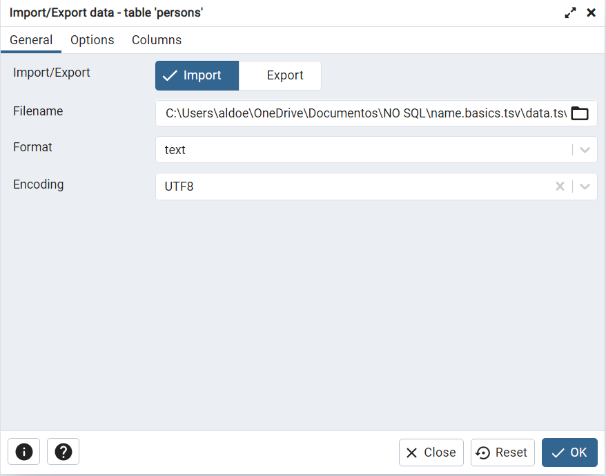
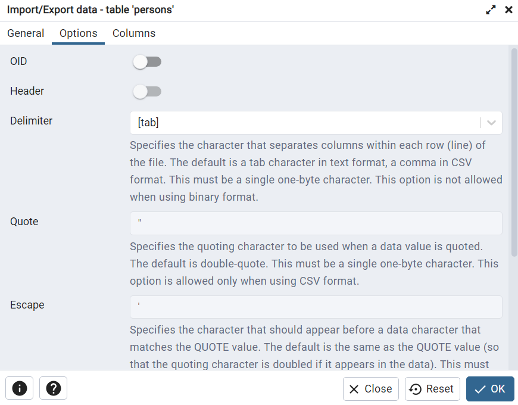
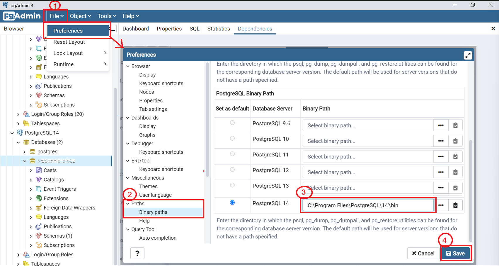
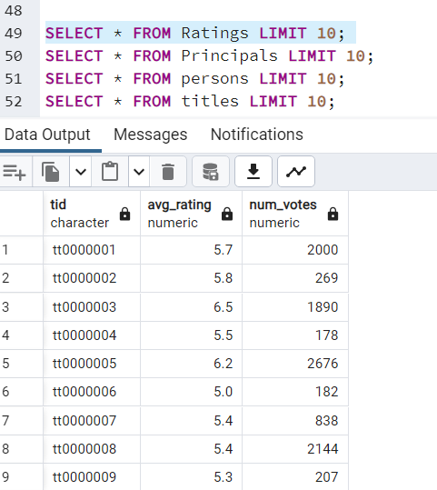
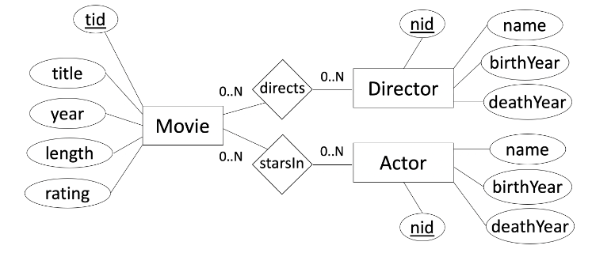
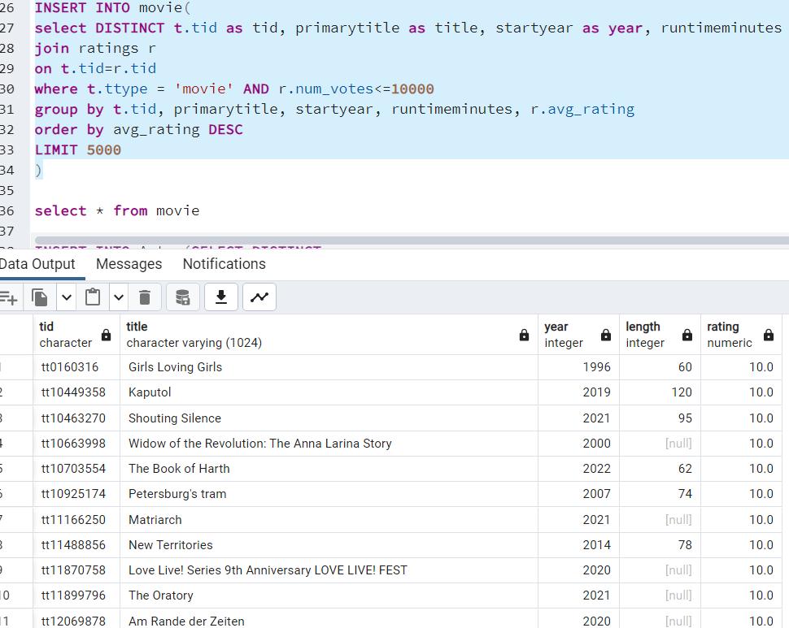
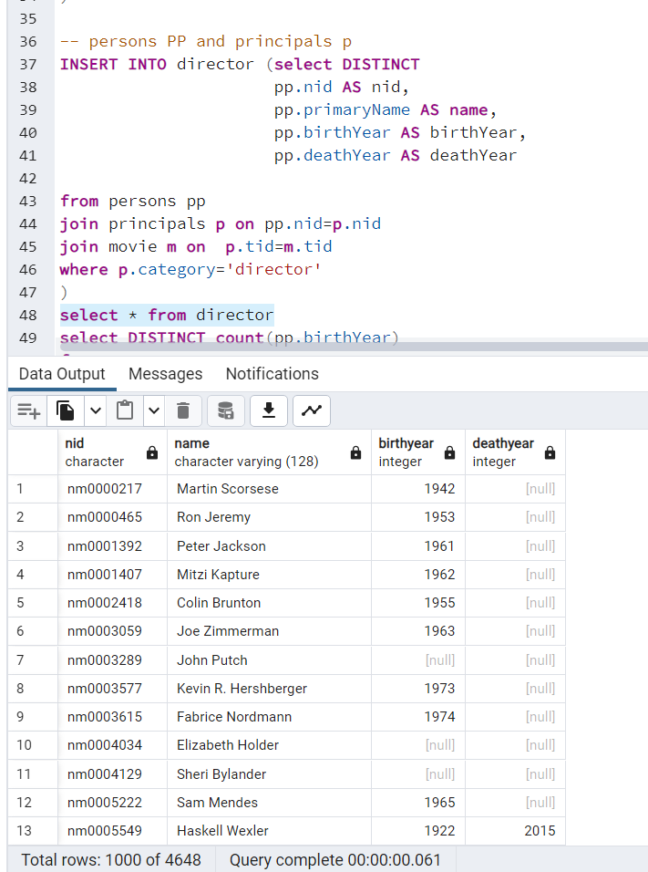
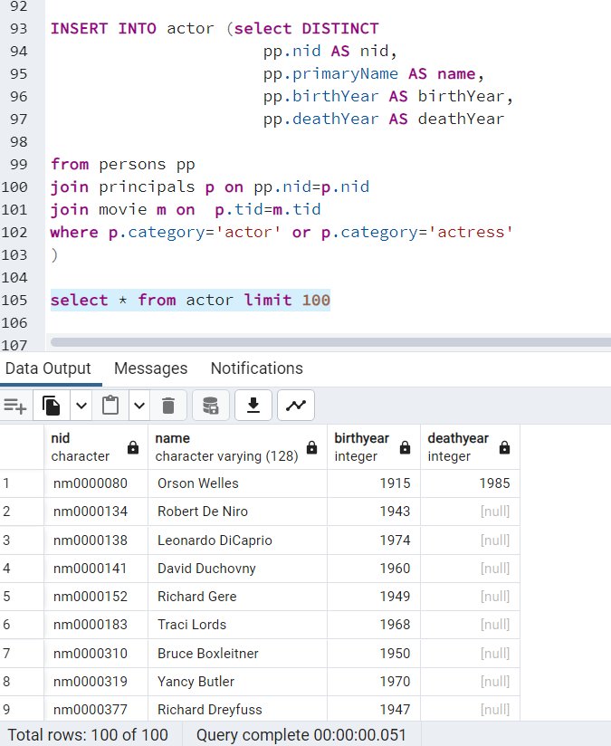
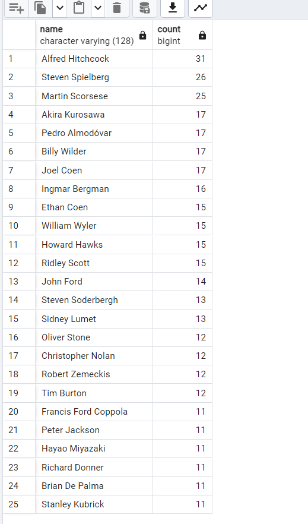
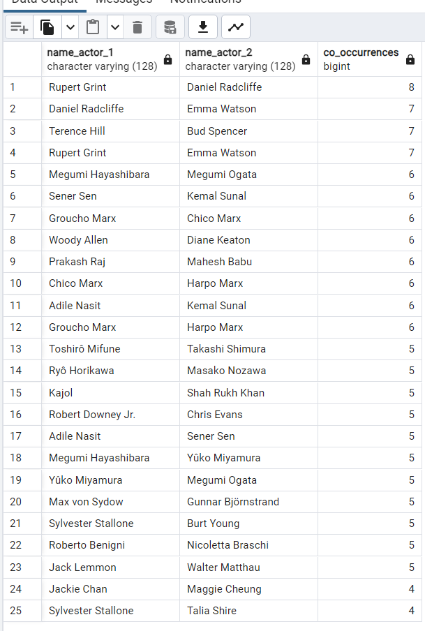

# EXERCISE SHEET 1

Start to download the Databases from the IMDB

- name.basics.tsv.gz
- title.basics.tsv.gz
- title. principals.tsv.gz
- title.ratings.tsv.gz
---

## Problem 1
### PART A
Create a database in pgAdmin (postgreSQL) called "IMDB"

![Alt text][database_create]

[database_create]: image.png

Create a table for each of the datasets we have using the query tool and load the data in the table; we can load using the *import/export data* assistant


Or by writing the next line of query: 
``` SQL
COPY principals 
FROM 'YTHE PATH OF THE DATA' NULL '\N' HEADER ENCODING 'UTF8'
```

The data needs to be in an accessible path such as the **temp** path

NOTE: As it is a TSV file we need tto import it using the divider as a [tab] and select it a header 



Once it's all done with the first table we need to replicate this step for the other 3 tables.

NOTE: If the "Import\Export tool" shows us an error regarding the utiity is  not found we have to do the next steps.



Now we can see the data imported into our tables using the Querie:
```SQL
SELECT * FROM table_name LIMIT 10
```
The LIMIT let us only see a part of the data since there are big data sets and it could take some time to load



### PART B

Now we have to create an E/R schema as follows:



And insert the data from the first 4 tables created in **PART A**; we must omit any form of keys and constraints in this step and also we must inlcude the datatypes of the attributes given in the queries from ***PART A***

*TABLE: MOVIE*
```SQL
CREATE TABLE Movie(
    tid char(10),
    title varchar(1024),
    year int,
    length int,
    rating numeric
);
```
***TABLE: DIRECTOR***
```SQL
CREATE TABLE Director(
    nid char(10),
    name varchar(128),
    birthYear int,
    deathYear int
);
```

***TABLE: ACTOR***

```SQL
CREATE TABLE Actor(
    nid char(10),
    name varchar(128),
    birthYear int,
    deathYear int
);
```

### PART C
Load the data from the first 4 tables created in *PART A* into the tables created in *PART B*

1. Load the data into the ***MOVIE*** table
```SQL
INSERT INTO movie(
select DISTINCT t.tid as tid, primarytitle as title, startyear as year, runtimeminutes as length, r.avg_rating as rating from titles t 
join ratings r 
on t.tid=r.tid 
where t.ttype = 'movie' AND r.num_votes=10000 
group by t.tid, primarytitle, startyear, runtimeminutes, r.avg_rating
order by avg_rating DESC
LIMIT 5000
)
```
Giving us this result:



We use the ***MOVIE*** table to add the other values to the table director and actor

*For Director Table*
```SQL
INSERT INTO director 
(select DISTINCT 
    pp.nid AS nid,
    pp.primaryName AS name,
    pp.birthYear AS birthYear,
    pp.deathYear AS deathYear					  
from persons pp
join principals p on pp.nid=p.nid
join movie m on  p.tid=m.tid
where p.category='director'
)
```


*For Actor Table*

```SQL
INSERT INTO actor (
select DISTINCT 
    pp.nid AS nid,
    pp.primaryName AS name,
    pp.birthYear AS birthYear,
    pp.deathYear AS deathYear	  
from persons pp
join principals p on pp.nid=p.nid
join movie m on  p.tid=m.tid
where p.category='actor' or p.category='actress'
)
```


### Part D

It's needed to determine a set of *non-trivial functional* dependencies (FDs) (recall that the *primary key* of a table already determines all other attributes, but there may be more dependencies but there may be more dependencies in the "real world").
Based on these FDs, determine the *keys* and *normal forms* for each of your relations.

- ***Movie***
    
    {tid} -> {title, year, length, rating}

    {tid,title} -> {year,length, rating}


- ***Director***
    
    {nid} -> {name, birthYear, deathYear}

- ***Actor***

    {nid} -> {name, birthYear, deathYear}

-----
**First Normal Form**
- Is in the (1NF) iff all atributes values of every tuple are atomic. ***It's in the 1NF***

**Second Normal Form**
- Iff for every non-trivial FD X -> Y in F it holds that X is not a proper subset of a key of R or Y is an attribute of a key of R. ***It's in the 2NF***

**Third Normal Form**
- Iff for every non-trivial FD X -> Y in  it holds that X is a superkey of R or Y is an attribute of a key of R. ***It's in the 3NF***

------
## Problem 2

### Part A
Apply *PRIMARY KEY* and *FOREIGN KEY* constraints in SQL to the target schema and use *ON UPDATE CASCADE* and *DELETE CASCADE* policies for all foreign keys

To start with this we have to ***ALTER*** the tables


## Problem 3 
a) Select the most popular directors based on how many movies they directed, stop after the top 25 directors with the most movies. Also make sure to only return those directors which never appeared as an actor in any movie. 

The first one is solved with the next querie: 
```SQL
SELECT name, COUNT(movieid)
FROM Director 
JOIN DirectedBy ON directorid=nid
WHERE Director.nid NOT IN (
	SELECT directorID 
	FROM Directedby
	JOIN ActorinMovie ON directorID=actorID
)
GROUP BY name
ORDER BY COUNT desc
LIMIT 25
```
And it gives the next result



------
We have now the next problem:
b) Select the top 25 pairs of actors that occur together in a same movie, ordered by the number of
movies in which they co-occur. 

```SQL
SELECT A.name AS name_actor_1, B.name AS name_actor_2, COUNT(*) AS co_occurrences
FROM ActorinMovie AS A1
JOIN ActorinMovie AS A2 ON A1.movieID = A2.movieID AND A1.actorID < A2.actorID
JOIN Actor AS A ON A1.actorID = A.nid
JOIN Actor AS B ON A2.actorID = B.nid
GROUP BY A.name, B.name
ORDER BY co_occurrences DESC
LIMIT 25;
```
Givng us the next result:



-------

(c) Find frequent 2-itemsets of actors or directors who occurred together in at least 4 movies (using the
A-Priori Step #1)

```SQL
WITH ActorDirectorPairs AS (
    SELECT A.actorID AS ActorID, D.directorID AS DirectorID,A.movieID AS movieID
    FROM ActorinMovie AS A
    JOIN DirectedBy AS D ON A.movieID = D.movieID
)
SELECT ActorID, DirectorID, COUNT(DISTINCT movieID) AS co_occurrences
FROM ActorDirectorPairs
GROUP BY ActorID, DirectorID
HAVING COUNT(DISTINCT movieID) >= 4
ORDER BY co_occurrences DESC
```


